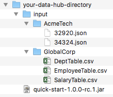
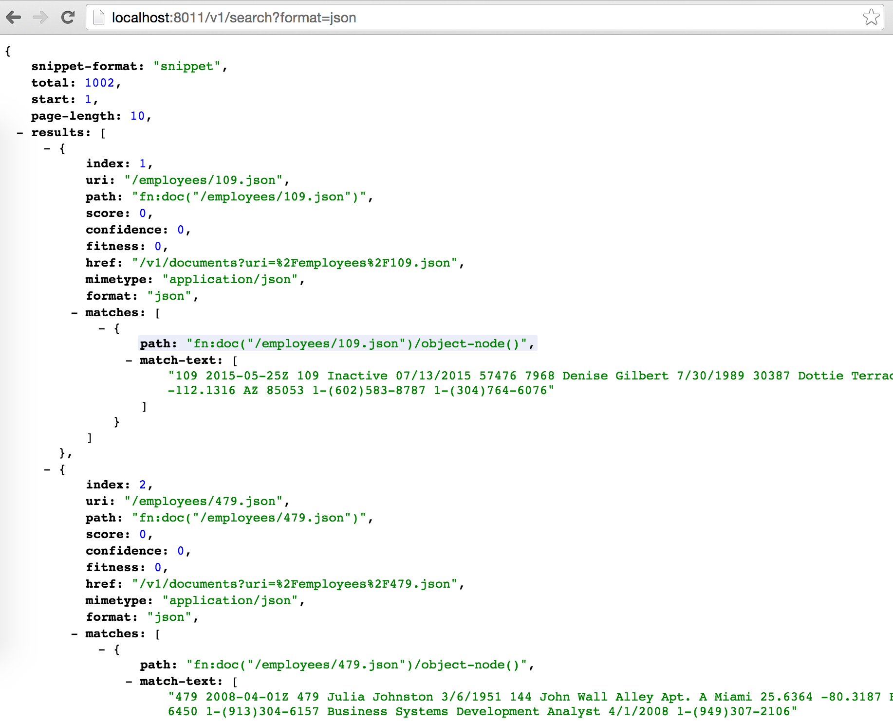

# QuickStart

QuickStart is a simple User Interface that you can run locally to start working with the Data Hub quickly. With QuickStart you will have a working hub in a matter of minutes. No need to worry about deployment strategies or configuration details. Simply run the jar and point it at your MarkLogic installation.

**\*QuickStart is not meant for production applications. We assume that you are running QuickStart on your local host.**

## QuickStart Architecture

# Tutorial
This tutorial will walk you through setting up a very simple hub for HR data. Your company Global Corp has provided you with CSV dumps of 3 tables. Additionally you are receiving JSON data files from a recently acquired company Acme Tech. You are responsible for loading data from both systems into your data hub to make them accessible to internal systems.

## 1 - Download and Install MarkLogic

Follow the instructions [here](http://docs.marklogic.com/guide/installation){:target="_blank"}{:target="_blank"} for installing MarkLogic.

<iframe width="420" height="315" src="https://www.youtube.com/embed/WaRi9HMtz5Q" frameborder="0" allowfullscreen></iframe>

## 2 - Download the QuickStart Jar

- Create a folder for this hub project and cd into it.

~~~
mkdir data-hub
cd data-hub
~~~
{: .language-bash}

- Download the quick-start-*.jar from the [releases page](https://github.com/marklogic/marklogic-data-hub/releases/latest){:target="_blank"} and place it in the folder you just created.

## 3 - Download the Sample Data

- Create a folder to hold your input data  

~~~
mkdir input
~~~
{: .language-bash}

- Download the [Zip file of sample data](../data/hr-data.zip){:target="_blank"} into the **input** folder you just created. Now extract it.

Your directory should look like this:

## 4 - Run the QuickStart

- Open a terminal window in the data-hub directory
- Run the Jar

~~~
java -jar quick-start-*.jar
~~~
{: .language-bash}
- Open the QuickStart Application in your browser:
  [http://localhost:8080](http://localhost:8080){:target="_blank"}

## 5 - Install the Hub

After opening the QuickStart Application provide the hostname, username, and password for your MarkLogic installation. Press the Login Button. The hub will automatically install into your MarkLogic instance.

## 6 - Create Your First Entity

Entities are the business objects that you will be working with in the hub. Start by defining a new Entity for Employees. Click the **New Entity** button. Now fill out the popup with information about your entity. 

You have just created an Entity with some basic Flows.

> **Input Flows** are responsible for getting data into the Hub staging area. 

> **Conformance Flows** are responsible for batch transformation of data from staging to final.

Now press **Deploy to Server**. You have just deployed your plugins into MarkLogic server. Plugins are the "stored procedures" that make up flows.

## 7 - Ingest Global Corp Data

Now that your entity is created you want to ingest some data. QuickStart uses the [MarkLogic Content Pump](https://docs.marklogic.com/guide/mlcp){:target="_blank"} to ingest data. Press the **Load Data** button next to an input flow. Point the dialog to the input/GlobalCorp directory. Choose the **Delimited Text** Data Format and then press **Submit**.

Behind the scenes QuickStart is running [MarkLogic Content Pump](https://docs.marklogic.com/guide/mlcp) to ingest the CSV data files. During ingest they are converted to JSON because you chose **json** as your Data Format for your flow.

## 8 - Create Flows for Acme Tech

Next you will want to create an Input and Conformance flow for Acme Tech. Start by clicking the **New** button next to Input Flows. Then fill out the form. Continue by clicking the **New** button next to Conformance Flows. Then fill out the form.

## 9 - Ingest Acme Tech Data

Now you need to load the data for Acme Tech. Press the **Load Data** button next to an input flow. Point the dialog to the input/AcmeTech directory. Choose the **Documents** Data Format and then press **Submit**.

Behind the scenes QuickStart is running [MarkLogic Content Pump](https://docs.marklogic.com/guide/mlcp) to ingest the CSV data files. During ingest they are converted to JSON because you chose **json** as your Data Format for your flow.

## 10 - Prep for Conform

All of our data is loaded into the staging area. While it's possible to conform the data right now it's not very useful. The out of the box conformance plugins will simply copy the staging data to the final data area.

We are going to enhance the data a bit so that it can be more easily searched and accessed. To do this we will identify some commonalities between our two data sets and choose a few fields to extract into the header section of our final envelopes.

For this tutorial we will pull out 3 headers:

- employee id
- hire date
- salary

Because we are dealing with two separate data sources we will put the logic for each source into its own flow.

### Global Corp Header Plugin

Use your favorite text editor to open the data-hub/plugins/entities/Employee/conformance/conform-global-corp/headers/headers.sjs file. Replace its contents with this:

### Global Corp Collector

The collector is a plugin that provides a list of items to the Conformance flow to be acted upon. By default the out of the box collector will return all document URIs in the system. We need to change this. For Global Corp we want to return a list of Employee IDs. This allows us to iterate over each employee ID and create an employee document per ID.

Use your favorite text editor to open the data-hub/plugins/entities/Employee/conformance/conform-global-corp/collector/collector.sjs file. Replace its contents with this:

### Acme Tech header plugin

Use your favorite text editor to open the data-hub/plugins/entities/Employee/conformance/conform-acme-tech/headers/headers.sjs file. Replace its contents with this:

### Acme Tech Collector

For Acme Tech we want to return a list of URIs. Since the Acme Tech data came to us as JSON documents, there is only one document for every employee.

Use your favorite text editor to open the data-hub/plugins/entities/Employee/conformance/conform-acme-tech/collector/collector.sjs file. Replace its contents with this:

## 11 - Conform the data

You ingested your data. You created plugins that will extract common fields into the headers. You edited the collectors to only operate on certain data. Now you are ready to conform. Simply press the **Run** button next to both conformance flows.

## 12 - Consume the Data

Now you can access your data via several REST endpoints. Your conformed data is available on the Final HTTP server. The defaul port is 8011. A full list of REST endpoints is available here: [http://docs.marklogic.com/REST/client](http://docs.marklogic.com/REST/client){:target="_blank"}

Open the [Staging Search Endpoint](http://localhost:8010/v1/search?format=json){:target="_blank"} against your local instance.

Open the [Final Search Endpoint](http://localhost:8011/v1/search?format=json){:target="_blank"} against your local instance.

*Picture here is the Final Search endpoint.*

## 13 - Wrapping Up

Congratulations! You just created a Data Hub.

- You loaded CSV and JSON files.
- You conformed your data by extracting common header fields.
- Your data is now fully accessible via the [MarkLogic REST API](http://docs.marklogic.com/REST/client){:target="_blank"}
